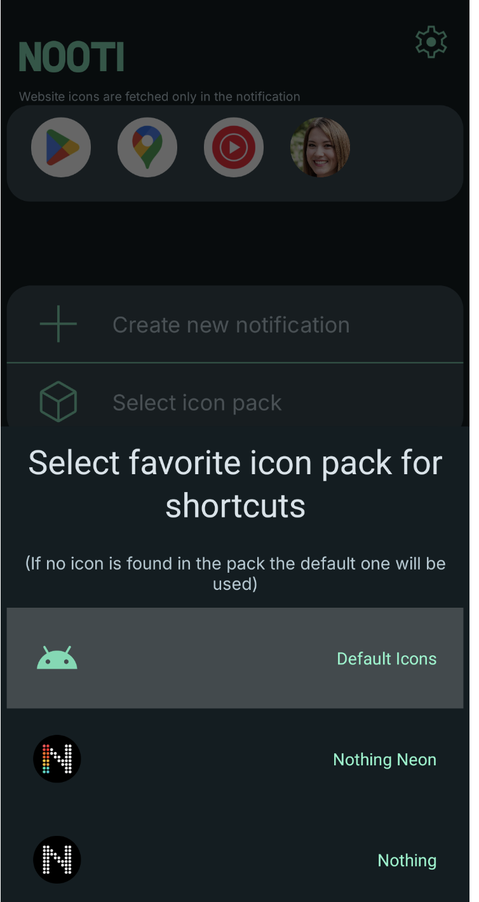

# Nooti - Notification Shorcuts

 

<b>Pin what matters most to you in your notifications shade and get to it in a few taps!</b>.

## Download it on [Google Play Store]((https://play.google.com/store/apps/details?id=com.ZetaDev.Nooti))

Nooti is minimal productivity tool for android that lets you create a persistent notification with shortcuts to your favorite apps, contacts and websites.

**Nooti has no ads but it has a premium version that increase the number of shorcuts creatale**

## Features and Screenshots

 

✨​ Nooti's goal to give users a minimal and clean way to reach their favorites apps, contacts or website without cluttering their phone home in the leasst invasive way possible by giving the possibility of creating a notification with shortcusts to such apps. Nooti is functional and aesthetically pleasing at the same time

📱 📞 🌐  App, Contacts & websites these are the 3 things, at the moment, you can put as shortcuts. Nooti will also try to fetch a favicon for the website

 

🎨 Custom Icon Pack Support: you can use third-party icon packs currently installed to style your shortcuts to better match your phone style. If the pack has the right icon, Nooti will use it for the apps shortcuts!

 

🔒 Working shortcuts in the lock screen: The shorcut notification are clickable and works in the lock screen too, saving you a few taps and seconds

 

⚡ Lightweight & Battery Friendly: Nooti has a minimal power usage, you won't feel anything battery wise when you have Nooti enabled

⚙️​ Nooti offer various setting and additional feature to complete the experience such as:

* Change the theme, PocketMark support both Light and Dark theme
* Choose to restart the notification at the phone reboot
* Change language, at the moment PocketMark support:
	* English 🇬🇧
	* Italian 🇮🇹​
 	* French 🇫🇷​
* Change if display or not the contacts photo and websites icons
* And more

   

Additionally, the settings panel provides convenient access to various useful resources, such as links to my other apps, a feedback button, credits etc...

📶​ Nooti can work perfectly offline and does not need internet functionality (internet is used only to retrive the websites icons for their shortcuts but can work without internet too)

🔍 Accessible by All: Nooti is fully labeled and compatible with screen reading software, ensuring a seamless experience for users who rely on accessibility features.

# What can you do to help the app?

Other than just using the app (for which I'm incredibly grateful) you can:

- ⭐ [Rate this app on the Play Store](https://play.google.com/store/apps/details?id=com.ZetaDev.PocketMark)
- ​ 💬 [Share the app with your friends and online](https://twitter.com/intent/post?text=Do%20you%20need%20to%20create%2C%20edit%20or%20read%20%23markdown%20files%20on%20your%20%23android%20phone%3F%0A%0AWell%20why%20not%20use%20PocketMark%3F%20Simple%2C%20powerful%20and%20good%20looking&url=http%3A%2F%2Fplay.google.com%2Fstore%2Fapps%2Fdetails%3Fid%3Dcom.zetadev.markdownapp)

## My other works

PocketMark was created just by me in my little free time between my full time job and university, if you liked it consider also checking out my  [other apps on the Playstore](https://play.google.com/store/apps/dev?id=7424750802271343300 )
